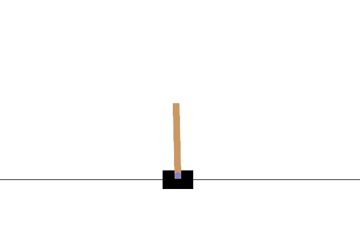

# DQN for CartPole-v1 🚀

Deep Q-Network implementation solving Gymnasium's CartPole-v1 environment. Achieved **195+ average score over 100 episodes** in **448 episodes**.[file:2]

## Results


**Score**: 262/500 timesteps (pure greedy policy)

## Features
- Target network + experience replay (10k buffer)
- Epsilon-greedy (1.0 → 0.05, decay=0.999)
- Two hidden layers (64 units, ReLU), Adam optimizer

## Quick Start
```bash
pip install -r requirements.txt
python -m src.train          # Train (~5-10 min)
python -m src.evaluate       # Generate GIF

# DQN CartPole-v1: Reinforcement Learning TP1 🚀

[](cartpole_agent_performance.gif)

**Deep Q-Network implementation solving Gymnasium's CartPole-v1 environment.** Achieved **195.16 average score over 100 episodes in 448 episodes** (solved criteria: ≥195/100 episodes).

**Author**: Kopparapu Nithin Sai Kumar | Paris-Saclay University | Machine Vision & AI MSc

---

## 🎯 Project Objective

Implement a **Deep Q-Network (DQN)** agent to solve the **CartPole-v1** environment from Gymnasium (OpenAI Gym successor). The environment is considered **solved** when the agent achieves an average reward of **≥195 over 100 consecutive episodes** (max episode length: 500 timesteps).

**✅ Status**: Solved in **448 episodes** with **final evaluation score: 262/500** (pure greedy policy).

---

## 🏗️ CartPole-v1 Environment

| **Feature** | **Details** |
|-------------|-------------|
| **State Space** | 4D continuous: `[cart_position, cart_velocity, pole_angle, pole_angular_velocity]` |
| **Action Space** | Discrete (2): `0=Left`, `1=Right` |
| **Reward** | `+1` per timestep pole stays balanced + cart stays on screen |
| **Episode End** | Pole falls (`|θ| > 12°`) OR cart leaves screen (`|x| > 2.4`) OR 500 timesteps |
| **Solved Criteria** | Average reward ≥195 over 100 consecutive episodes |

---

## 🧠 DQN Architecture & Algorithm

### Neural Network (Q-Function Approximator)


| **Layer** | **Neurons** | **Activation** |
|-----------|-------------|----------------|
| Input | 4 (state) | - |
| Hidden 1 | 64 | ReLU |
| Hidden 2 | 64 | ReLU |
| Output | 2 (actions) | Linear |

### Key DQN Components
- **Experience Replay**: 10k capacity buffer, batch size 64
- **Target Network**: Hard updates every 100 episodes (stabilizes training)
- **Epsilon-Greedy**: ε=1.0 → 0.05 (decay=0.999)
- **Loss**: MSE between predicted Q(s,a) and target `r + γ*maxQ(s',a')`
- **Optimizer**: Adam (lr=1e-4)

### Q-Learning Update

**Hyperparameters** (optimized from experimentation):
| Parameter | Value | Description |
|-----------|-------|-------------|
| `γ` (discount) | 0.99 | Future reward importance |
| `lr` | 1e-4 | Adam learning rate |
| `ε_start` | 1.0 | Initial exploration |
| `ε_min` | 0.05 | Minimum exploration |
| `ε_decay` | 0.999 | Exploration decay |
| `buffer_size` | 10,000 | Replay buffer capacity |
| `batch_size` | 64 | Training batch size |
| `target_update` | 100 episodes | Target network sync |

---

## 📊 Training Results


**Evaluation (ε=0, pure greedy)**: **Score: 262/500 timesteps**

---

## 🚀 Quick Start

### Prerequisites
- Python 3.8+
- GPU recommended (RTX 4060 supported)

### Installation
```bash
# Clone repository
git clone https://github.com/YOUR_USERNAME/dqn-cartpole-tp1.git
cd dqn-cartpole-tp1

# Create & activate virtual environment
python -m venv .venv
.venv\Scripts\activate  # Windows
# source .venv/bin/activate  # Linux/Mac

# Install dependencies
pip install -r requirements.txt

RL_cartpole/
├── src/                    # Modular Python implementation
│   ├── __init__.py
│   ├── agent.py           # DQNAgent with target network + replay
│   ├── models.py          # QNetwork (4-64-64-2)
│   ├── replay_buffer.py   # Experience replay (10k capacity)
│   ├── train.py          # Training loop + early stopping
│   └── evaluate.py       # GIF generation (render_mode="rgb_array")
├── models/                # Trained weights
│   └── cartpole_dqn_weights.pth
├── cartpole_agent_performance.gif  # Evaluation visualization
├── requirements.txt       # Dependencies
├── README.md             # This file
└── .gitignore            # Clean Python repo
